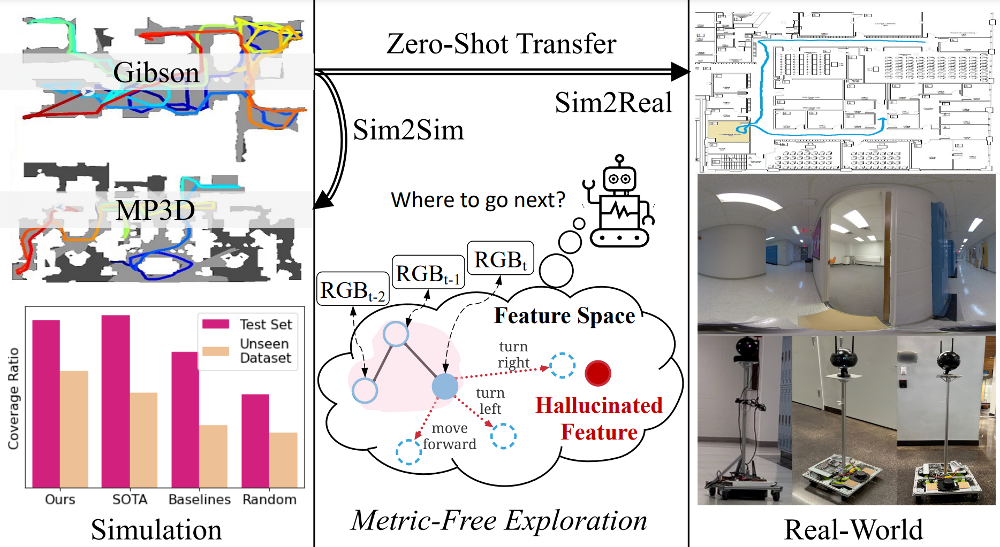

# [Metric-Free Exploration for Topological Mapping by Task and Motion Imitation in Feature Space, RSS 2023](https://www.roboticsproceedings.org/rss19/p099.html).

[Yuhang He](https://yuhanghe01.github.io/)\*, [Irving Fang](https://irvingf7.github.io/)\*, [Yiming Li](https://yimingli-page.github.io/), [Rushi Bhavesh Shah](https://rushibs.github.io/), [Chen Feng](https://scholar.google.com/citations?user=YeG8ZM0AAAAJ)



## Abstract

We propose DeepExplorer, a simple and lightweight metric-free exploration method for topological mapping of unknown environments. It performs task and motion planning (TAMP) entirely in image feature space. The task planner is a recurrent network using the latest image observation sequence to hallucinate a feature as the next-best exploration goal. The motion planner then utilizes the current and the hallucinated features to generate an action taking the agent towards that goal. Our novel feature hallucination enables imitation learning with deep supervision to jointly train the two planners more efficiently than baseline methods. During exploration, we iteratively call the two planners to predict the next action, and the topological map is built by constantly appending the latest image observation and action to the map and using visual place recognition (VPR) for loop closing. The resulting topological map efficiently represents an environment's connectivity and traversability, so it can be used for tasks such as visual navigation. We show DeepExplorer's exploration efficiency and strong sim2sim generalization capability on large-scale simulation datasets like Gibson and MP3D. Its effectiveness is further validated via the image-goal navigation performance on the resulting topological map. We further show its strong zero-shot sim2real generalization capability in real-world experiments.


## Project Website
Please visit [this website](https://ai4ce.github.io/DeepExplorer/) for more information like **video presentation** and **visualization**.

## Environment Setup
Please refer to the `requirements.txt` for the environment we run our experiment in.

Note that we run all our experiments in `habitat-sim` and `habitat-lab` on version 0.1.6. The hash for `habitat-sim=0.1.6` is `781f787`. The hash for `habitat-lab=0.1.6` is `ac937fd`. Theoretically, the version between `habitat-sim` and `habitat-lab` should match, but we never experimented with this.

You could potentially run our code in a higher version of `habitat` since the software should be fairly backward compatible, but we noticed that some configuration files need to be manually changed to implement the 360 panorama camera we used, so we decided to stick with an old version of `habitat`

Because of the old `habitat` version, our Python version is stuck with `3.6``.

I wrote [this tutorial](https://docs.google.com/document/d/1XujCOLZ3d-76s0n1U7U1S_X2c2eHNGTT4ZTIgBPw8NI/edit?usp=sharing) on installing `habitat` for our lab's junior members. It focuses on installing it in an HPC environment, but it may still be helpful for you.

## TL;DR
`train` contains all the code for training
`exploration` contains all the code for exploration inference
`navigation` contains all the code for navigation inference

## Data Preparation
To generate the expert demonstration data we used for training, please refer to the `experdemon_datacollect` folder

## Exploration Training
The DeepExplorer model is defined in `models/motion_task_joint_planner.py`. The script to train it can be found in `train/train_explorer.py`. 

The dataset that we wrote to handle the expert demo data can be found in `train/DataProvider_explorer.py`.

The pre-trained model can be found in `pretrained_model` folder.

## Exploration Inference
In the `exploration` folder, you can find the scripts to run the exploration on Gibson and MP3D with `explore_[dataset].py`. To calculate the coverage ratio, the script `coverage_ratio_area_`[dataset].py` can be used.

We adopted two different scripts for the two datasets to accommodate some differences, such as floor numbers.

## Navigation
### Action Assigner
In `train/train_actassigner.py`, you can train the `ActionAssigner` that we used in the map completion stage when we enhance our topological map with visual similarity. 

The dataset for this can be found in `/train/DataProvider_actassigner.py`, and the model is defined in `models/action_assigner.py`

The pre-trained model can be found in `pretrained_model` folder.

### Navigation Pipeline
For the navigation pipeline, including running VPR to enhance the topological map and actually perform navigation, please refer to the `navigation` folder

## Pretrained Models
All the pretrained models can be found in `pretrained_model` folder

## Citations
If you found our work helpful, please use the following information to cite our work
```
@INPROCEEDINGS{He-RSS-23, 
  AUTHOR    = {Yuhang He AND Irving Fang AND Yiming Li AND Rushi Bhavesh Shah 
  AND Chen Feng}, 
  TITLE     = {{Metric-Free Exploration for Topological Mapping by Task and 
  Motion Imitation in Feature Space}}, 
  BOOKTITLE = {Proceedings of Robotics: Science and Systems}, 
  YEAR      = {2023}, 
  ADDRESS   = {Daegu, Republic of Korea}, 
  MONTH     = {July}, 
  DOI       = {10.15607/RSS.2023.XIX.099} 
} 
```